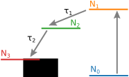

# Repository for Bleach Traces

A bleach trace is a solution to the differential equation describing the dynamics
of a pump probe experiment. 

## Four Level Model
This is described in **link paper here**.

### Contains

- four_level_model.py
  Solution to the four level model in python.
  
- four_level_model.nb
  Mathematica notebook used to calculate the solution.
  
- requirements.txt
  List of pyhton modules needed to run.
